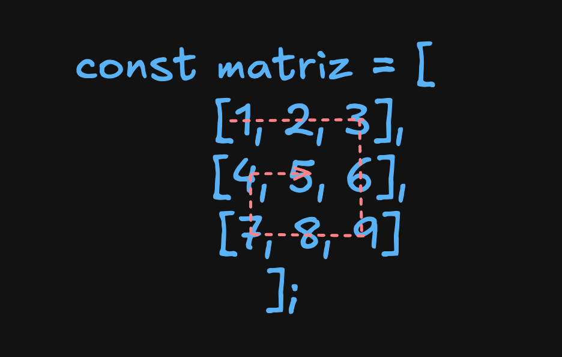

# Guía de Estudio: Arrays y Manipulación Básica

## Recursos de Aprendizaje

### Documentación
- [MDN Web Docs: Arrays](https://developer.mozilla.org/es/docs/Web/JavaScript/Reference/Global_Objects/Array)
- [JavaScript Info: Arrays](https://es.javascript.info/array)

### Visualizadores de Algoritmos
- [VisuAlgo](https://visualgo.net/)
- [Algorithm Visualizer](https://algorithm-visualizer.org/)

---

## 1. Operaciones Básicas con Arrays

### 1.1 Declaración e Inicialización

```javascript
const arr = [1,2,3,4]                   // [1,2,3,4]
const arr2 = new Array(1,2,3,4)         // [1,2,3,4]
const arr3 = Array(4)                   // [empty × 4] pero arr[n] es undefined "Cosas del lenguaje"
const arr4 = Array(9.3);                // RangeError: Longitud de arreglo no válida
const wisenArray = Array.of(9.3);       // wisenArray contiene solo un elemento 9.3
```

> **Nota**: Existen 2 formas de inicializar un array:
> 1. Con corchetes `[]`
> 2. Con la palabra reservada `new Array()`
>
> La diferencia principal es que `new Array()` con un solo argumento numérico crea un array con ese tamaño, mientras que `[]` crea un array con los elementos especificados.

#### Parámetros del constructor Array

- **elementN**: Los elementos con los que se inicializa el array, excepto cuando se pasa un solo argumento numérico.
  
- **arrayLength**: Si el único argumento es un número entero entre 0 y 2^32 - 1, devuelve un array con esa longitud (con slots vacíos, no con valores `undefined`). Si el número no es entero, se produce un `RangeError`.

### 1.2 Acceso a Elementos

```javascript
const arr = [1,2,3,4]
arr[0]  // 1
arr[1]  // 2
```

### 1.3 Métodos Principales

#### push: Añade un elemento al final del array

```javascript
const arr = [1,2,3,4]
arr.push(10)  // [1,2,3,4,10]
```

#### pop: Elimina el último elemento del array

```javascript
const arr = [1,2,3,4]
arr.pop()  // [1,2,3]
```

#### shift: Elimina el primer elemento del array

```javascript
const arr = [1,2,3,4]
arr.shift()  // [2,3,4]
```

#### unshift: Añade un elemento al inicio del array

```javascript
const arr = [1,2,3,4]
arr.unshift(10)  // [10,1,2,3,4]
```

#### splice: Modifica el contenido eliminando y/o agregando elementos

```javascript
const months = ['Jan', 'March', 'April', 'June'];
months.splice(1, 0, 'Feb')  // ['Jan', 'Feb', 'March', 'April', 'June']

// Otro ejemplo
const pets = ['dog', 'cat', 'mouse', 'ant', 'snake'];
pets.splice(2, 2, 'elephant');  // ['dog', 'cat', 'elephant', 'snake']
pets.splice(1, 1, 'mouse', 'ant')  // ['dog', 'mouse', 'ant', 'elephant', 'snake']
```

> **Sintaxis**: `array.splice(inicio, eliminar, item1, item2, ...)`
> - **inicio**: Índice donde comenzar el cambio
> - **eliminar**: Número de elementos a eliminar
> - **item1, item2, ...**: Elementos a agregar

#### slice: Devuelve una copia de parte del array

```javascript
const arr = [1,2,3,4]
const arr2 = arr.slice(1,3)  // [2,3] (el elemento en índice 3 no se incluye)
arr  // [1,2,3,4] (el array original no se modifica)

const demoArr = new Array(10)  // [empty × 10]
demoArr.fill(1)  // [1,1,1,1,1,1,1,1,1,1]
demoArr.splice(2,2,0,0)  // [1,1,0,0,1,1,1,1,1,1]
const demoSlice = demoArr.slice(1,5)  // [1,0,0,1]
const anotherSlice = demoSlice.slice(1)  // [0,0,1]
```

> **Sintaxis**: `array.slice(inicio, fin)`
> - **inicio**: Índice donde comenzar la extracción
> - **fin**: Índice donde terminar la extracción (no incluido)
> - Con índices negativos, indica posiciones desde el final

### 1.4 Recorrido y Transformación

#### for: Control total con acceso por índice

```javascript
const arr = new Array(10)
arr.fill(0)
for (let i = 0; i < arr.length; i++) {
   arr[i] = i
}
arr  // [0,1,2,3,4,5,6,7,8,9]
```

#### for...of: Recorrido simplificado sin modificación directa

```javascript
const arr = new Array(10)
const auxArr = []
arr.fill(0)
for (let el of arr) {
   el += 1
   auxArr.push(el)
}
arr  // [0,0,0,0,0,0,0,0,0,0]
auxArr  // [1,1,1,1,1,1,1,1,1,1]
```

#### forEach: Ejecuta una función por cada elemento

```javascript
const array1 = [1,2,3];
const arr = []
array1.forEach((element) => arr.push(element * 2));
console.log(array1)  // [1,2,3]
console.log(arr)  // [2,4,6]
```

#### map: Crea un nuevo array transformando cada elemento

```javascript
const arr = [1,2,3,4,5]
const doubles = arr.map((el) => el * 2)

console.log(arr)  // [1,2,3,4,5]
console.log(doubles)  // [2,4,6,8,10]
```

#### filter: Crea un nuevo array con elementos que cumplen una condición

```javascript
const words = ["spray", "elite", "exuberant", "destruction", "present"];
const result = words.filter((word) => word.length > 6);
console.log(words)  // ["spray", "elite", "exuberant", "destruction", "present"]
console.log(result);  // ["exuberant", "destruction", "present"]
```

#### find: Retorna el primer elemento que cumple una condición

```javascript
const array1 = [5, 12, 8, 130, 44];
const found = array1.find((element) => element > 10);
console.log(found);  // 12
```

#### findIndex: Retorna el índice del primer elemento que cumple una condición

```javascript
const array1 = [5, 12, 8, 130, 44];
const foundIndex = array1.findIndex((element) => element > 10);
console.log(foundIndex);  // 1
```

#### reduce: Reduce el array a un único valor

```javascript
const array1 = [1, 2, 3, 4];
const initialValue = 0;

const sumWithInitial = array1.reduce(
  (accumulator, currentValue) => accumulator + currentValue,
  initialValue,
);  // 0 + 1 + 2 + 3 + 4

console.log(sumWithInitial);  // 10
```

---

## 2. Arrays Multidimensionales

### 2.1 Arrays Bidimensionales (Matrices)

```javascript
// Una matriz 3x3
const matriz = [
  [1, 2, 3],  // Fila 0
  [4, 5, 6],  // Fila 1
  [7, 8, 9]   // Fila 2
];

// Acceso a elementos
console.log(matriz[1][2]);  // 6 (fila 1, columna 2)
console.log(matriz[0][0]);  // 1 (fila 0, columna 0)

// Para acceder al 5: matriz[1][1]
```

### 2.2 Operaciones con Arrays Multidimensionales

#### Aplanar arrays multidimensionales

```javascript
const matrix = [
  [1, 2, 3],
  [4, 5, 6],
  [7, 8, 9],
];

// Usando reduce con concat
const flattened = matrix.reduce((acc, row) => acc.concat(row), []);
// El método concat() une los arrays en uno solo

// Usando operador spread
const flattened2 = [...matrix[0], ...matrix[1], ...matrix[2]];

// Usando reduce con spread (más elegante)
const flattened3 = matrix.reduce((acc, row) => [...acc, ...row], []);

console.log(flattened);   // [1, 2, 3, 4, 5, 6, 7, 8, 9]
console.log(flattened2);  // [1, 2, 3, 4, 5, 6, 7, 8, 9]
console.log(flattened3);  // [1, 2, 3, 4, 5, 6, 7, 8, 9]
```

#### Recorrer una matriz completa

```javascript
const matriz = [
   [1,2,3],
   [4,5,6],
   [7,8,9]
];

// Usando bucles anidados
for (let i = 0; i < matriz.length; i++) {
  for (let j = 0; j < matriz[i].length; j++) {
    console.log(`Elemento en posición [${i}][${j}]: ${matriz[i][j]}`);
  }
}

// Usando métodos funcionales
matriz.forEach((fila, i) => {
  fila.forEach((valor, j) => {
    console.log(`Elemento en posición [${i}][${j}]: ${valor}`);
  });
});
```

#### Crear una matriz dinámica

```javascript
const rows = 3;
const cols = 4;
const matrix = Array.from({ length: rows }, () => Array(cols).fill(0));
console.log(matrix);  // [[0, 0, 0, 0], [0, 0, 0, 0], [0, 0, 0, 0]]
```

> **Array.from()** crea una nueva instancia de Array a partir de un objeto iterable
> - **arrayLike**: objeto iterable para crear el array
> - **mapFn**: función que se ejecutará para cada elemento
> - **thisArg**: valor a usar como this cuando se ejecute mapFn

---

## 3. Problema: Recorrido en Espiral de una Matriz

### 3.1 Descripción del Problema

Dado una matriz de n x m, devuelve todos los elementos en orden espiral.

**Input:** `[[1,2,3], [4,5,6], [7,8,9]]`
**Output:** `[1,2,3,6,9,8,7,4,5]`



### 3.2 Implementación

```javascript
function recorridoEspiral(matriz) {
   const resultado = [];  // Array para almacenar el resultado
   if (matriz.length === 0) return resultado;
   
   let filaInicio = 0, filaFin = matriz.length - 1;
   let colInicio = 0, colFin = matriz[0].length - 1;
   
   while (filaInicio <= filaFin && colInicio <= colFin) {
      // Recorrer derecha ->
      for (let i = colInicio; i <= colFin; i++) {
         resultado.push(matriz[filaInicio][i]);
      } 
      filaInicio++;
      
      // Recorrer abajo ↓
      for (let i = filaInicio; i <= filaFin; i++) {
         resultado.push(matriz[i][colFin]);
      }
      colFin--;
      
      // Recorrer izquierda <-
      if (filaInicio <= filaFin) {
         for (let i = colFin; i >= colInicio; i--) {
            resultado.push(matriz[filaFin][i]);
         }
         filaFin--;
      }
      
      // Recorrer arriba ↑
      if (colInicio <= colFin) {
         for (let i = filaFin; i >= filaInicio; i--) {
            resultado.push(matriz[i][colInicio]);
         }
         colInicio++;
      }
   }
   
   return resultado;
}

const matriz = [
   [1, 2, 3],
   [4, 5, 6],
   [7, 8, 9]
];

console.log(recorridoEspiral(matriz));  // [1,2,3,6,9,8,7,4,5]
```

### 3.3 Visualización del Recorrido

#### Paso 1: Recorrer primera fila (→)
```
┌───┬───┬───┐
│ 1→│ 2→│ 3 │
├───┼───┼───┤
│   │   │   │
├───┼───┼───┤
│   │   │   │
└───┴───┴───┘
Elementos: [1,2,3]
```

#### Paso 2: Recorrer última columna (↓)
```
┌───┬───┬───┐
│   │   │ ↓ │
├───┼───┼───┤
│   │   │ 6 │
├───┼───┼───┤
│   │   │ 9 │
└───┴───┴───┘
Elementos: [1,2,3,6,9]
```

#### Paso 3: Recorrer última fila (←)
```
┌───┬───┬───┐
│   │   │   │
├───┼───┼───┤
│   │   │   │
├───┼───┼───┤
│ 7 │ 8←│   │
└───┴───┴───┘
Elementos: [1,2,3,6,9,8,7]
```

#### Paso 4: Recorrer primera columna (↑)
```
┌───┬───┬───┐
│ ↑ │   │   │
├───┼───┼───┤
│ 4 │   │   │
├───┼───┼───┤
│   │   │   │
└───┴───┴───┘
Elementos: [1,2,3,6,9,8,7,4]
```

#### Paso 5: Recorrer el centro
```
┌───┬───┬───┐
│   │   │   │
├───┼───┼───┤
│   │ 5 │   │
├───┼───┼───┤
│   │   │   │
└───┴───┴───┘
Elementos: [1,2,3,6,9,8,7,4,5]
```

### 3.4 Explicación del Algoritmo

El algoritmo mantiene cuatro variables para rastrear los límites no recorridos:

- `filaInicio`: Primera fila no recorrida
- `filaFin`: Última fila no recorrida
- `colInicio`: Primera columna no recorrida
- `colFin`: Última columna no recorrida

En cada iteración:

1. **Recorrer hacia la derecha**: Elementos de `filaInicio` desde `colInicio` hasta `colFin`
   ```javascript
   for (let i = colInicio; i <= colFin; i++) {
     resultado.push(matriz[filaInicio][i]);  // [1,2,3]
   }
   filaInicio++;  // Incrementamos para no volver a recorrer esta fila
   ```

2. **Recorrer hacia abajo**: Elementos de `colFin` desde `filaInicio` hasta `filaFin`
   ```javascript
   for (let i = filaInicio; i <= filaFin; i++) {
     resultado.push(matriz[i][colFin]);  // [6,9]
   }
   colFin--;  // Decrementamos para no volver a recorrer esta columna
   ```

3. **Recorrer hacia la izquierda**: Elementos de `filaFin` desde `colFin` hasta `colInicio`
   ```javascript
   if (filaInicio <= filaFin) {  // Verificamos que aún haya filas por recorrer
     for (let i = colFin; i >= colInicio; i--) {
       resultado.push(matriz[filaFin][i]);  // [8,7]
     }
     filaFin--;  // Decrementamos para no volver a recorrer esta fila
   }
   ```

4. **Recorrer hacia arriba**: Elementos de `colInicio` desde `filaFin` hasta `filaInicio`
   ```javascript
   if (colInicio <= colFin) {  // Verificamos que aún haya columnas por recorrer
     for (let i = filaFin; i >= filaInicio; i--) {
       resultado.push(matriz[i][colInicio]);  // [4]
     }
     colInicio++;  // Incrementamos para no volver a recorrer esta columna
   }
   ```

### 3.5 Complejidad

- **Tiempo**: O(n×m) donde n es el número de filas y m es el número de columnas
- **Espacio**: O(n×m) para almacenar el resultado

---

## 4. Algoritmos de Búsqueda

### 4.1 Búsqueda Lineal (O(n))
- Recorre secuencialmente cada elemento hasta encontrar el objetivo
- Mejor para arrays pequeños o no ordenados

Ejemplo de búsqueda lineal: Dado un arreglo(pequeño de numeros enteros sin importar el orden), encontrar el indice del numero objetivo, en caso de no encontrarlo, retornar -1.

```javascript
const array = [1,2,3,4,5];
const target = 3;

function linearSearch(array, target) {
   for (let i = 0; i < array.length; i++){
      const element = array[i];
      if(element === target) return i;
   }

   return -1;
}

```

### 4.2 Búsqueda Binaria (O(log n))
- Requiere que el array esté ordenado
- Divide el espacio de búsqueda a la mitad en cada iteración
- Consulta el siguiente enlace para mas info [Búsqueda Binaria](https://www.youtube.com/watch?v=6RiJN7fp4BI&t=25s)

```javascript
//Creamos una matriz ordenada de 100 elementos
const array = Array.from({length: 100},(_, index) => index + 1 ); // el _ representa el valor por defecto que al ser undefined se ignora logrando asi crear un array ordenado de 100 elementos

const target = 25; // Este es el valor que buscaremos

function binarySearch(array, target){
 let left = 0, rigth = array.length -1;
 
 while(left <= rigth){
   const middle = Math.floor((left + rigth) / 2);
   const element = array[middle];

   if(element ==  target ) return middle;
   if(element < target ) left = middle + 1;
   rigth = middle - 1;
 }

 return -1;
}

console.log(binarySearch(array, target)); // 24
```

### 4.3 Búsqueda por Interpolación
- Mejora de la búsqueda binaria para distribuciones uniformes
- Estima la posición probable del elemento
- Mejor caso: O(1) - cuando el elemento está exactamente donde la fórmula predice
- Caso promedio: O(log log n) - mucho mejor que búsqueda binaria O(log n) para distribuciones uniformes
- Peor caso: O(n) - cuando la distribución es muy sesgada o irregular
- La búsqueda por interpolación es especialmente útil en casos como índices de bases de datos donde los datos están uniformemente distribuidos y el tamaño del conjunto de datos es grande.

```javascript
const arr = Array.from({length: 1000}, (_, index) => index + 1);
const target = 280;

function interpolationSearch(arr, target) {
    let low = 0; // Indice del inicio del array
    let high = arr.length - 1; // Indice del final del array
    
    while (low <= high && target >= arr[low] && target <= arr[high]) { // Mientras que low sea menor o igual a high y el valor objetivo sea mayor o igual al valor del inicio y menor o igual al valor del final
        // Fórmula de interpolación para estimar la posición
        let pos = low + Math.floor(
            ((target - arr[low]) * (high - low)) / 
            (arr[high] - arr[low])
            //Esta fórmula viene de la interpolación lineal en matemáticas, que es una técnica para estimar valores entre dos puntos conocidos.

            // (target - arr[low]) / (arr[high] - arr[low]) 
            //Esto nos da un número entre 0 y 1 que representa qué tan lejos está nuestro objetivo entre el valor mínimo y máximo

            //(high - low) * proporción
            // Esto convierte la proporción de valores en una proporción de índice

            // low + (proporción de índices)
            // Esto nos da el índice estimado

            // visualmente La formula se ve asi:
            // low + Math.floor(
            //                      (target - arr[low]) * (high - low)) / 
            //                      (arr[high] - arr[low])
            // )
            //
        );

        
        // Si encontramos el elemento
        if (arr[pos] === target) {
            return pos;
        }
        
        // Si el elemento es mayor, busca en la mitad derecha
        if (arr[pos] < target) {
            low = pos + 1;
        } 
        // Si el elemento es menor, busca en la mitad izquierda
        else {
            high = pos - 1;
        }
    }
    
    return -1; // Elemento no encontrado
}

console.log(interpolationSearch(arr, target));// 279
```

### 4.4 Análisis de Complejidad
- **Temporal**: Cuánto tiempo toma el algoritmo en ejecutarse

   - O(1) - constante: el tiempo es constante, no importa el tamaño del array

   ```javascript
   function obtenerPrimerElemento(arr) {
    return arr[0];  // Siempre toma el mismo tiempo, independientemente del tamaño del array
   }  
   ```

   - O(log n) - logarítmica: el tiempo crece en función del logaritmo del tamaño del array (ejemplo binary search)
   ```javascript
   function buscarElemento(arr, target) {
    let low = 0;
    let high = arr.length - 1;
    
    while (low <= high) {
        let mid = Math.floor((low + high) / 2);
        
        if (arr[mid] === target) {
            return mid;  // Tiempo logarítmico
        } else if (arr[mid] < target) {
            low = mid + 1;
        } else {
            high = mid - 1;
        }
    }
    
    return -1;  // Tiempo logarítmico
   }
   ```
   - O(n) - lineal: el tiempo crece en función del tamaño del array (ejemplo linear search)
   ```javascript
   function buscarElemento(arr, target) {
    for (let i = 0; i < arr.length; i++) {
        if (arr[i] === target) {
            return i;  // Tiempo lineal
        }
    }
    
    return -1;  // Tiempo lineal
   }
   ```
   - O(n log n) - lineal-logarítmica: el tiempo crece en función del tamaño del array y el logaritmo del tamaño del array (ejemplo merge sort)

   ```javascript
   // Merge Sort
   function merge(left, right) { // Fusiona dos arrays ordenados
    let result = [];
    let leftIndex = 0;
    let rightIndex = 0;
    
    // Comparar elementos y fusionar en orden
    while (leftIndex < left.length && rightIndex < right.length) {
        if (left[leftIndex] < right[rightIndex]) {
            result.push(left[leftIndex]);
            leftIndex++;
        } else {
            result.push(right[rightIndex]);
            rightIndex++;
        }
    }
    
    // Agregar elementos restantes
    return result.concat(left.slice(leftIndex)).concat(right.slice(rightIndex));
   }  

   function mergeSort(arr) { // Ordena un array usando merge sort
    if (arr.length <= 1) return arr;
    const mid = Math.floor(arr.length / 2);
    const left = mergeSort(arr.slice(0, mid));
    const right = mergeSort(arr.slice(mid));
    return merge(left, right);
   }
   ```

   - O(n²) - cuadrática: el tiempo crece en función del cuadrado del tamaño del array

   ```javascript
   function bubbleSort(arr) {
    for (let i = 0; i < arr.length; i++) {
        for (let j = 0; j < arr.length - i - 1; j++) {
            if (arr[j] > arr[j + 1]) {
                [arr[j], arr[j + 1]] = [arr[j + 1], arr[j]];
            }
        }
    }
    return arr;
   }
   ```
   - O(n³) - cúbica: el tiempo crece en función del cubo del tamaño del array

   - O(2ⁿ) - exponencial: el tiempo crece en función de la potencia del tamaño del array

   ```javascript
   // Fibonacci recursivo (sin memoización)
   function fibonacci(n) {
    if (n <= 1) return n;
    return fibonacci(n - 1) + fibonacci(n - 2);
   }  
   ```
   - O(n!) - factorial: el tiempo crece en función del factorial del tamaño del array

- **Espacial**: Cuánta memoria adicional requiere el algoritmo

   - O(1) - constante: el espacio es constante, no importa el tamaño del array
   - O(log n) - logarítmica: el espacio crece en función del logaritmo del tamaño del array
   - O(n) - lineal: el espacio crece en función del tamaño del array
   - O(n log n) - lineal-logarítmica: el espacio crece en función del tamaño del array y el logaritmo del tamaño del array
   - O(n²) - cuadrática: el espacio crece en función del cuadrado del tamaño del array
   - O(n³) - cúbica: el espacio crece en función del cubo del tamaño del array
   - O(2ⁿ) - exponencial: el espacio crece en función de la potencia del tamaño del array
   - O(n!) - factorial: el espacio crece en función del factorial del tamaño del array
