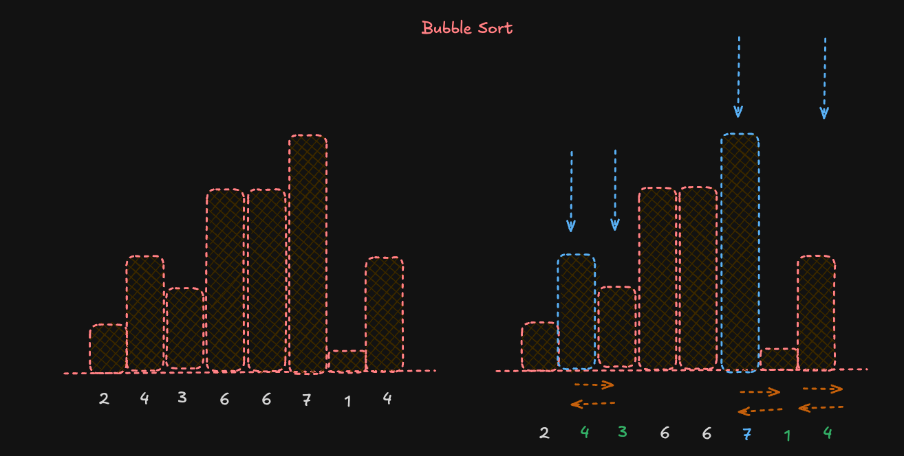
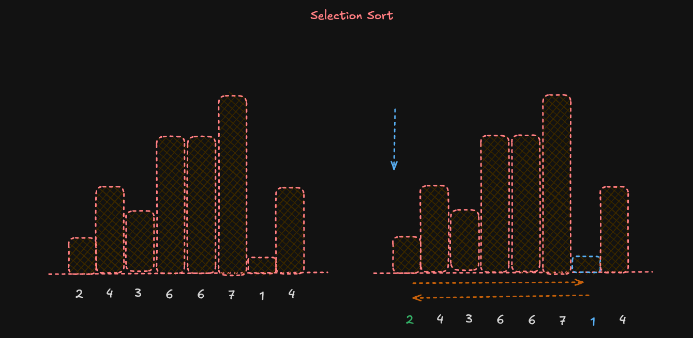
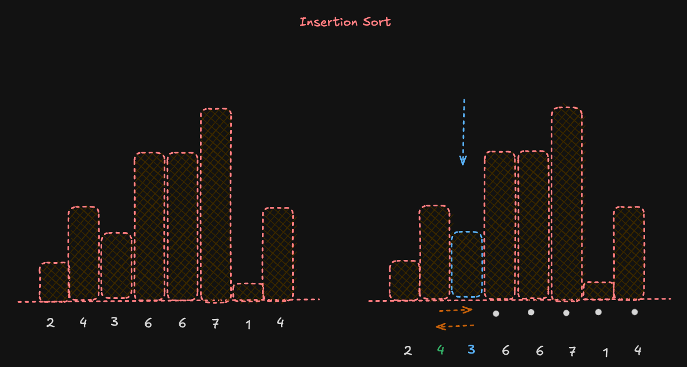

# Guía de Estudio: Algoritmos de Ordenamiento y Two-Pointer Technique

## Recursos de Aprendizaje

### Documentación
- [MDN Web Docs: Array.prototype.sort()](https://developer.mozilla.org/es/docs/Web/JavaScript/Reference/Global_Objects/Array/sort)
- [JavaScript Info: Métodos de Arrays](https://es.javascript.info/array-methods)

### Visualizadores de Algoritmos
- [Sorting Algorithms Visualizations](https://www.toptal.com/developers/sorting-algorithms)
- [VisuAlgo - Sorting](https://visualgo.net/en/sorting)
- [Algorithm Visualizer](https://algorithm-visualizer.org/)

---

## 1. Algoritmos de Ordenamiento

### 1.1 Bubble Sort (O(n²))

El Bubble Sort es uno de los algoritmos de ordenamiento más simples. Funciona comparando pares de elementos adyacentes y intercambiándolos si están en el orden incorrecto.

```javascript
function bubbleSort(arr) {
  const n = arr.length;
  
  for (let i = 0; i < n; i++) {
    // Flag para optimización
    let swapped = false;
    
    // Últimos i elementos ya están en su lugar
    for (let j = 0; j < n - i - 1; j++) {
      // Comparar elementos adyacentes
      if (arr[j] > arr[j + 1]) {
        // Intercambiar elementos
        [arr[j], arr[j + 1]] = [arr[j + 1], arr[j]];
        swapped = true;
      }
    }
    
    // Si no hubo intercambios en esta pasada, el array está ordenado
    if (!swapped) break;
  }
  
  return arr;
}

//otro ejemplo de codigo seria usando un do while
function bubbleSortDoWhile(arr) { // recibimos un arg array
  const n = arr.length; // definimos n que es el tamaño del array
  let swapped; // definimos swapped que es un flag para optimización, la cual nos dice si hubo intercambios en la pasada
  do { 
    swapped = false; // inicializamos swapped en false
    for (let i = 0; i < n - 1; i++) { // recorremos el array
      if (arr[i] > arr[i + 1]) { // si el elemento actual es mayor que el siguiente
        [arr[i], arr[i + 1]] = [arr[i + 1], arr[i]]; // intercambiamos los elementos
        swapped = true; // si hubo intercambios, ponemos swapped en true
      }
    }
  } while (swapped); // repetimos el proceso hasta que no haya intercambios
  return arr;
}

// Ejemplo de uso
const array = [64, 34, 25, 12, 22, 11, 90];
console.log(bubbleSort([...array]));  // [11, 12, 22, 25, 34, 64, 90]
```

#### Análisis de Complejidad
- **Tiempo**: O(n²) en el peor y caso promedio, O(n) en el mejor caso (array ya ordenado)
- **Espacio**: O(1) - ordenamiento en el lugar

#### Ventajas y Desventajas
- **Ventajas**: Simple de implementar, eficiente para conjuntos pequeños
- **Desventajas**: Ineficiente para conjuntos grandes

#### Ejemplo grafico:
Basicamente lo que hace bubble sort es comparar cada elemento con el siguiente y si el siguiente es menor, los intercambia, tratando de llevar siempre el elemento mayor al final del array, asi hasta que el array este ordenado.



### 1.2 Selection Sort (O(n²))

El Selection Sort funciona seleccionando repetidamente el elemento más pequeño del subarray no ordenado y colocándolo al principio.

```javascript
function selectionSort(arr) {
  const n = arr.length; // definimos n que es el tamaño del array
  
  for (let i = 0; i < n - 1; i++) { // recorremos el array
    // Encontrar el índice del elemento mínimo
    let minIndex = i; // definimos minIndex que es el indice del elemento minimo
    
    for (let j = i + 1; j < n; j++) { // recorremos el array
      if (arr[j] < arr[minIndex]) { // si el elemento actual es menor que el minimo
        minIndex = j; // actualizamos minIndex
      }
    }
    
    // Intercambiar el elemento mínimo con el primer elemento
    if (minIndex !== i) { // si el minimo no es el primer elemento
      [arr[i], arr[minIndex]] = [arr[minIndex], arr[i]]; // intercambiamos los elementos
    }
  }
  
  return arr;
}

// Ejemplo de uso
const array = [64, 25, 12, 22, 11];
console.log(selectionSort([...array]));  // [11, 12, 22, 25, 64]
```

#### Análisis de Complejidad
- **Tiempo**: O(n²) en todos los casos
- **Espacio**: O(1) - ordenamiento en el lugar

#### Ventajas y Desventajas
- **Ventajas**: Simple, realiza menos intercambios que Bubble Sort
- **Desventajas**: Ineficiente para conjuntos grandes, no adaptativo

#### Ejemplo grafico:

Selection sort es un algoritmo de ordenamiento que funciona seleccionando repetidamente el elemento más pequeño del subarray no ordenado y colocándolo al principio. Entiendase por subarray como el array que se encuentra desde la posicion i hasta la ultima posicion del array, esto porque en cada iteracion, el subarray no ordenado se reduce en una posicion, quedando en i el elemento ordenado.



### 1.3 Insertion Sort (O(n²))

El Insertion Sort construye el array ordenado final un elemento a la vez, similar a cómo ordenamos cartas en la mano.

```javascript
function insertionSort(arr) {
  const n = arr.length;
  
  for (let i = 1; i < n; i++) {
    // Elemento actual a insertar en la parte ordenada
    let key = arr[i];
    
    // Índice del elemento anterior
    let j = i - 1;
    
    // Mover elementos mayores que key a una posición adelante
    while (j >= 0 && arr[j] > key) { // mientras j sea mayor o igual a 0 y el elemento en j sea mayor que key
      arr[j + 1] = arr[j];  // movemos el elemento en j una posicion adelante
      j--; // decrementamos j
    }
    
    // Insertar el elemento en la posición correcta
    arr[j + 1] = key;
  }
  
  return arr;
}

// Ejemplo de uso
const array = [12, 11, 13, 5, 6];
console.log(insertionSort([...array]));  // [5, 6, 11, 12, 13]
```

#### Análisis de Complejidad
- **Tiempo**: O(n²) en el peor y caso promedio, O(n) en el mejor caso (array casi ordenado)
- **Espacio**: O(1) - ordenamiento en el lugar

#### Ventajas y Desventajas
- **Ventajas**: Eficiente para conjuntos pequeños y parcialmente ordenados
- **Desventajas**: Ineficiente para conjuntos grandes desordenados

#### Ejemplo grafico:

Vamos a ir ordenando el arreglo de izquierda a derecha, colocando cada elemente en su sitio, es decir, el elemento 5 se coloca en la posicion 4, el elemento 6 se coloca en la posicion 5, etc. aqui te dejo un [recurso](https://algorithm-visualizer.org/brute-force/insertion-sort) mas ilustrativo 



### 1.4 Merge Sort (O(n log n))

Merge Sort es un algoritmo de ordenamiento basado en la técnica "divide y vencerás". Divide el array en mitades, ordena cada mitad y luego combina las mitades ordenadas.En este [recurso](https://algorithm-visualizer.org/divide-and-conquer/merge-sort) puedes ver un ejemplo grafico de como funciona merge sort

```javascript
function mergeSort(arr) {
  // Caso base: un array de 0 o 1 elementos ya está ordenado
  if (arr.length <= 1) {
    return arr;
  }
  
  // Dividir el array en mitades
  const middle = Math.floor(arr.length / 2);
  const left = arr.slice(0, middle);
  const right = arr.slice(middle);
  
  // Ordenar recursivamente cada mitad y combinarlas
  return merge(mergeSort(left), mergeSort(right));
}

function merge(left, right) {
  let result = [];
  let leftIndex = 0;
  let rightIndex = 0;
  
  // Comparar elementos de ambos arrays y añadir el menor al resultado
  while (leftIndex < left.length && rightIndex < right.length) {
    if (left[leftIndex] < right[rightIndex]) {
      result.push(left[leftIndex]);
      leftIndex++;
    } else {
      result.push(right[rightIndex]);
      rightIndex++;
    }
  }
  
  // Añadir los elementos restantes
  return result.concat(left.slice(leftIndex)).concat(right.slice(rightIndex));
}

// Ejemplo de uso
const array = [38, 27, 43, 3, 9, 82, 10];
console.log(mergeSort([...array]));  // [3, 9, 10, 27, 38, 43, 82]
```

#### Análisis de Complejidad
- **Tiempo**: O(n log n) en todos los casos
- **Espacio**: O(n) - requiere espacio adicional para las mitades

#### Ventajas y Desventajas
- **Ventajas**: Rendimiento predecible, estable (mantiene el orden relativo de elementos iguales)
- **Desventajas**: Requiere espacio adicional

### 1.5 Quick Sort (O(n log n))

Quick Sort también utiliza "divide y vencerás". Selecciona un elemento "pivote" y particiona el array alrededor del pivote. [Aqui](https://algorithm-visualizer.org/divide-and-conquer/quicksort) puedes ver un ejemplo grafico de como funciona quick sort.

```javascript
function quickSort(arr, low = 0, high = arr.length - 1) { // recibimos el array, el indice del primer elemento y el indice del ultimo elemento
  if (low < high) { // si el indice del primer elemento es menor que el indice del ultimo elemento
    // Índice de partición
    const pivotIndex = partition(arr, low, high); // obtenemos el indice del pivote
    
    // Ordenar elementos antes y después del pivote
    quickSort(arr, low, pivotIndex - 1);
    quickSort(arr, pivotIndex + 1, high);
  }
  
  return arr;
}

function partition(arr, low, high) { // recibimos el array, el indice del primer elemento y el indice del ultimo elemento
  // Elemento pivote (último elemento)
  const pivot = arr[high];
  
  // Índice del elemento más pequeño
  let i = low - 1;
  
  for (let j = low; j < high; j++) {
    // Si el elemento actual es menor o igual que el pivote
    if (arr[j] <= pivot) {
      i++;
      // Intercambiar elementos
      [arr[i], arr[j]] = [arr[j], arr[i]];
    }
  }
  
  // Intercambiar el pivote con el elemento en (i + 1)
  [arr[i + 1], arr[high]] = [arr[high], arr[i + 1]];
  
  // Devolver el índice de posición del pivote
  return i + 1;
}

// Ejemplo de uso
const array = [10, 7, 8, 9, 1, 5];
console.log(quickSort([...array]));  // [1, 5, 7, 8, 9, 10]
```

#### Análisis de Complejidad
- **Tiempo**: O(n log n) en el caso promedio y mejor, O(n²) en el peor caso
- **Espacio**: O(log n) para la pila de llamadas recursivas

#### Ventajas y Desventajas
- **Ventajas**: Muy eficiente en la práctica, ordenamiento en el lugar
- **Desventajas**: Peor caso O(n²), no estable

### 1.6 Comparación de Algoritmos de Ordenamiento

| Algoritmo | Mejor Caso | Caso Promedio | Peor Caso | Espacio | Estable | Adaptativo |
|-----------|------------|---------------|-----------|---------|---------|------------|
| Bubble Sort | O(n) | O(n²) | O(n²) | O(1) | Sí | Sí |
| Selection Sort | O(n²) | O(n²) | O(n²) | O(1) | No | No |
| Insertion Sort | O(n) | O(n²) | O(n²) | O(1) | Sí | Sí |
| Merge Sort | O(n log n) | O(n log n) | O(n log n) | O(n) | Sí | No |
| Quick Sort | O(n log n) | O(n log n) | O(n²) | O(log n) | No | No |

> **Nota**: 
> - **Estable**: Mantiene el orden relativo de elementos iguales
> - **Adaptativo**: Se comporta más eficientemente cuando el array está parcialmente ordenado

---

## 2. Two-Pointer Technique

La técnica de dos punteros es un patrón algorítmico que utiliza dos referencias (punteros) para recorrer una estructura de datos, generalmente un array o una lista enlazada.

### 2.1 Concepto y Aplicaciones

La técnica de dos punteros se utiliza principalmente para:
- Búsqueda de pares que cumplan ciertas condiciones
- Detección de ciclos
- Eliminación de duplicados
- Inversión de arrays o listas
- Problemas de ventana deslizante

### 2.2 Punteros desde Extremos Opuestos

Esta variante utiliza dos punteros que comienzan desde los extremos opuestos del array y se mueven hacia el centro.

#### Ejemplo: Two Sum (Encontrar un par que sume un valor objetivo)

```javascript
function twoSum(nums, target) {
  // Ordenar el array primero
  const sortedNums = [...nums].sort((a, b) => a - b);
  
  let left = 0; // puntero de lado izquierdo
  let right = sortedNums.length - 1; // Puntero del lado derecho
  
  while (left < right) { // Mientras que el puntero izquierdo sea menor que el puntero derecho
    const sum = sortedNums[left] + sortedNums[right]; // sumamos los valores en dichos extremos
    
    if (sum === target) { // si la suma es igual al objetivo
      // Encontramos la pareja
      return [sortedNums[left], sortedNums[right]]; // retornamos los valores en un nuevo arreglo
    } else if (sum < target) { // si la suma es menor que el objetivo 
     // incrementamos el puntero izquierdo
      left++;
    } else { //si no
      // La suma es mayor, decrementamos el puntero derecho
      right--;
    }
  }
  
  // No se encontró ninguna pareja
  return null;
}

// Ejemplo de uso
const nums = [2, 7, 11, 15];
const target = 9;
console.log(twoSum(nums, target));  // [2, 7]
```

#### Ejemplo: Invertir un Array

```javascript
function reverseArray(arr) {
  let left = 0;
  let right = arr.length - 1;
  
  while (left < right) {
    // Intercambiar elementos
    [arr[left], arr[right]] = [arr[right], arr[left]];
    
    // Mover punteros hacia el centro
    left++;
    right--;
  }
  
  return arr;
}

// Ejemplo de uso
const array = [1, 2, 3, 4, 5];
console.log(reverseArray([...array]));  // [5, 4, 3, 2, 1]
```

### 2.3 Punteros con Diferentes Velocidades (Slow/Fast)

Esta variante utiliza dos punteros que se mueven a diferentes velocidades, generalmente uno más rápido que el otro.

#### Ejemplo: Eliminar Duplicados de un Array Ordenado

```javascript
function removeDuplicates(nums) {
  if (nums.length === 0) return 0;
  
  // Puntero lento - indica la posición donde colocar el próximo elemento único
  let slow = 0;
  
  // Puntero rápido - explora el array
  for (let fast = 1; fast < nums.length; fast++) {
    // Si encontramos un elemento diferente
    if (nums[fast] !== nums[slow]) {
      // Avanzamos el puntero lento
      slow++;
      // Colocamos el elemento único en la posición del puntero lento
      nums[slow] = nums[fast];
    }
  }
  
  // Devolver la longitud del subarray sin duplicados (slow + 1)
  return slow + 1;
}

// Ejemplo de uso
const nums = [1, 1, 2, 2, 3, 4, 4, 5];
const length = removeDuplicates(nums);
console.log(nums.slice(0, length));  // [1, 2, 3, 4, 5]
```

### 2.4 Detección de Ciclos

La técnica de punteros rápido/lento (también conocida como algoritmo de la tortuga y la liebre) es especialmente útil para detectar ciclos en estructuras de datos.

```javascript
// Ejemplo con una lista enlazada
class ListNode {
  constructor(val) {
    this.val = val;
    this.next = null;
  }
}

function hasCycle(head) {
  if (!head || !head.next) return false;
  
  let slow = head;
  let fast = head;
  
  // El puntero rápido avanza dos nodos por cada uno del lento
  while (fast && fast.next) {
    slow = slow.next;       // Avanza un nodo
    fast = fast.next.next;  // Avanza dos nodos
    
    // Si los punteros se encuentran, hay un ciclo
    if (slow === fast) {
      return true;
    }
  }
  
  // Si el puntero rápido llega al final, no hay ciclo
  return false;
}
```

### 2.5 Problema: Encontrar el Par más Cercano a un Valor Objetivo

```javascript
function findClosestPair(nums, target) {
  // Ordenar el array
  nums.sort((a, b) => a - b);
  
  let left = 0;
  let right = nums.length - 1;
  
  let closestDiff = Infinity;
  let closestPair = [];
  
  while (left < right) {
    const sum = nums[left] + nums[right];
    const diff = Math.abs(sum - target);
    
    // Si encontramos una diferencia menor, actualizamos el par más cercano
    if (diff < closestDiff) {
      closestDiff = diff; // Actualizamos closestDiff al valor de diff que es menor
      closestPair = [nums[left], nums[right]];  // Actualizamos el arreglo de pares a los pares de la diff menor
    }
    
    // Ajustamos los punteros según la suma
    if (sum < target) {
      left++;
    } else {
      right--;
    }
  }
  
  return closestPair;
}

// Ejemplo de uso
const nums = [1, 3, 4, 7, 10];
const target = 15;
console.log(findClosestPair(nums, target));  // [4, 10] (suma 14, diferencia 1)
```

### 2.6 Problema: Encontrar Tripletes que Sumen Cero

```javascript
function threeSum(nums) {
  const result = [];
  
  // Ordenar el array
  nums.sort((a, b) => a - b);
  
  for (let i = 0; i < nums.length - 2; i++) {
    // Evitar duplicados para el primer número
    if (i > 0 && nums[i] === nums[i - 1]) continue;
    
    let left = i + 1;
    let right = nums.length - 1;
    
    while (left < right) {
      const sum = nums[i] + nums[left] + nums[right];
      
      if (sum === 0) {
        // Encontramos un triplete
        result.push([nums[i], nums[left], nums[right]]);
        
        // Evitar duplicados para el segundo número
        while (left < right && nums[left] === nums[left + 1]) left++;
        // Evitar duplicados para el tercer número
        while (left < right && nums[right] === nums[right - 1]) right--;
        
        // Mover ambos punteros
        left++;
        right--;
      } else if (sum < 0) {
        // La suma es menor que cero, incrementamos el puntero izquierdo
        left++;
      } else {
        // La suma es mayor que cero, decrementamos el puntero derecho
        right--;
      }
    }
  }
  
  return result;
}

// Ejemplo de uso
const nums = [-1, 0, 1, 2, -1, -4];
console.log(threeSum(nums));  // [[-1, -1, 2], [-1, 0, 1]]
```

---

## 3. Ejercicios Prácticos

### 3.1 Implementación de Algoritmos de Ordenamiento

Implementa los siguientes algoritmos de ordenamiento y compara su rendimiento:
1. Bubble Sort
2. Selection Sort
3. Insertion Sort
4. Merge Sort
5. Quick Sort

### 3.2 Two Sum con Two-Pointer

Dado un array de números y un valor objetivo, encuentra dos números en el array que sumen el valor objetivo.

```javascript
// Implementa la función twoSum usando la técnica de dos punteros
function twoSum(nums, target) {
  // Tu código aquí
}
```

### 3.3 Eliminar Duplicados de un Array Ordenado

Dado un array ordenado, elimina los duplicados in-place y devuelve la nueva longitud.

```javascript
// Implementa la función removeDuplicates usando la técnica de dos punteros
function removeDuplicates(nums) {
  // Tu código aquí
}
```

### 3.4 Par más Cercano a un Valor Objetivo

Dado un array de números y un valor objetivo, encuentra el par de números cuya suma sea más cercana al valor objetivo.

```javascript
// Implementa la función findClosestPair usando la técnica de dos punteros
function findClosestPair(nums, target) {
  // Tu código aquí
}
```

### 3.5 Tripletes con Suma Cero

Dado un array de números, encuentra todos los tripletes únicos que sumen cero.

```javascript
// Implementa la función threeSum usando la técnica de dos punteros
function threeSum(nums) {
  // Tu código aquí
}
```

---

## 4. Recursos Adicionales

### 4.1 Libros Recomendados
- "Algorithms" por Robert Sedgewick y Kevin Wayne
- "Introduction to Algorithms" por Thomas H. Cormen, Charles E. Leiserson, Ronald L. Rivest y Clifford Stein

### 4.2 Plataformas de Práctica
- [LeetCode](https://leetcode.com/)
- [HackerRank](https://www.hackerrank.com/)
- [CodeSignal](https://codesignal.com/)

### 4.3 Visualizaciones
- [Sorting Algorithms Visualization](https://www.cs.usfca.edu/~galles/visualization/ComparisonSort.html)
- [Two Pointers Technique Visualization](https://algorithm-visualizer.org/)